# docker-image-ci-pipeline

## Who should use this ci template skeleton?

- Devops engineers who needs to deliver a compliant ci pipeline for a standard docker application (regardless of language) considering best practices as well as security aspects.

## Why use this ci template skeleton?

- Every ci template comes with an accompanying compliant pipeline that can be applied to it under Project > Settings > Compliance framework. Applying it will provide auto inclusion of checks, scan jobs and reporting.

- The skeleton abstracts to help devops engineers focus only on how to build and deploy the application while taking care of the other considerations upon usage.

- This project is open for Innersourcing. See [CONTRIBUTING](https://sgts.gitlab-dedicated.com/innersource/sgts/ship-hats/e2e-templates/contributing) for more information on this.

## Getting started

To make it easy for you to get started with using this docker image ci template, here's a list of recommended next steps and the flow diagram for your reference.

### CI Flow Diagram

```mermaid
flowchart TD
    subgraph F1[.gitlab-ci.yml]
    j13[delete-testing-image-job]
    end

    subgraph F5[DEPLOY.gitlab-ci.yml]
    d1[deploy-prod-manual-job]:::CF2--->j13
    end

    subgraph C1[Docker-Compliance:Sign]
    j11[sign-container-job]:::CF3-->j12[verify-container-signature]:::CF3-.-a5["Update DEPLOY.gitlab-ci.yml"]:::A -.-> d1
    end

    subgraph F4[TEST.gitlab-ci.yml]
    t1[unit-test-job]--->t2[integration-test-job]
    t2 -.-> j11
    end

    subgraph C2[Docker-Compliance:Test]
    j5[container_scanning*]:::CF1---j6[ship-fortify-sast*]:::CF1---j7[ship-nexus-iq-scan*]:::CF1---j8[merge-sboms]:::CF4---j9[ship-sonarqube-scan*]:::CF1---j10[ship-sonarqube-output-report*]:::CF1-.->a4["Update TEST.gitlab-ci.yml"]:::A-.->t1
    end

    subgraph F3[BUILD.gitlab-ci.yml]
    b1[build-job]-.->j5
    end

    subgraph F2[PREPARE.gitlab-ci.yml]
    p1[prepare-job]---a3["Update BUILD.gitlab-ci.yml"]:::A-->b1
    end

    subgraph C3[Docker-Compliance:.pre]
    j1[secret_detection]:::CF1---j2["iac_sast*"]:::CF1---j3["dependency_scanning* (if any)"]:::CF1---j4["sast* (if any)"]:::CF1-.-a2["Update PREPARE.gitlab-ci.yml"]:::A-.->p1
    end

    n1([start])---a1["Update variables in .gitlab-ci.yml and project's CICD settings"]:::A-->j1
    j13-->n2([end])

    classDef default fill:#ffd,stroke:#eee;
    classDef CF1 fill:#c9c983;
    classDef CF2 fill:#6cab68;
    classDef CF3 fill:#ed9542;
    classDef CF4 fill:#5679db;
    classDef A fill:#ddd;
    classDef F fill:#fff,stroke:#226;
    class F1,F2,F3,F4,F5 F;
    classDef C fill:#fff,stroke:#226,stroke-dasharray: 5 5;
    class C1,C2,C3 C;
    classDef N fill:#eef,stroke:#226;
    class n1,n2 N;
```

```mermaid
flowchart LR
    subgraph "Legend"
        direction LR
        n1(start) --- a1["user's task"] ---> j1
        j1 -...-> j2
        j5 ---> n2(end)
        subgraph "Compliance-Framework:Stage"
            direction LR
            j2[optional-job* from CF_LEVEL=1] --> j3[job from CF_LEVEL=2] --> j4[job from CF_LEVEL=3] --> j5[job from CF_LEVEL=4]
        end
        subgraph "File"
            direction LR
            j1[job]
        end
    end

    classDef J fill:#ffd,stroke:#eee;
    class j1 J;
    classDef CF1 fill:#c9c983;
    class j2 CF1;
    classDef CF2 fill:#6cab68;
    class j3 CF2;
    classDef CF3 fill:#ed9542;
    class j4 CF3;
    classDef CF4 fill:#5679db;
    class j5 CF4;
    classDef A fill:#ddd;
    class a1 A;
    classDef F fill:#fff,stroke:#226;
    class File,Legend F;
    classDef C fill:#fff,stroke:#226,stroke-dasharray: 5 5;
    class Compliance-Framework:Stage C;
    classDef N fill:#eef,stroke:#226;
    class n1,n2 N;
```


### Put your dockerfile in this repository

- In order for CI to build and deploy your dockerapp.

### Update reference for templates included from SHIP-HATS Templates

- Please update the reference to SHIP-HATS Templates from main to a versioned tags. You may refer to current version of SHIP-HATS Templates [here](https://sgts.gitlab-dedicated.com/innersource/sgts/ship-hats/ship-hats-templates#release-management) and the list of versioned tags available [here](https://sgts.gitlab-dedicated.com/innersource/sgts/ship-hats/ship-hats-templates/-/tags). Do note that when compliance framework is applied, the version of SHIP-HATS Templates will take precedence.

### Fill in **PREPARE.gitlab-ci.yml**

- Provide the relevant prepare job/s to build your dockerapp. Example: Initialize Docker Container Registry.

### Fill in **BUILD.gitlab-ci.yml**

- **build-job** is expected to have the following variables to build and publish docker image to a temporary image registry for pre-deploy verification:
  - TEST_REGISTRY

- **build-job** produces a saved tar at given path `$OUTPUT_IMAGE_ARTEFACT`. Expects `$OUTPUT_IMAGE_ARTEFACT`. Do include the following in variable `OPTS` IF it is updated for **build-job**:
    ``` yaml
    variables: # if OPTS has to be overwritten, pls ensure that it contains tar path to $OUTPUT_IMAGE_ARTEFACT
      OPTS: "--tarPath $OUTPUT_IMAGE_ARTEFACT"
    ```

- Do include the following in job script IF `script` key is updated for **build-job**:
    ``` yaml
    script: # if this has to be overwritten, pls ensure that the script for .build-and-push-docker-image is referenced.
      - echo "include your script (if any) required before build-and-push-docker-image"
      - !reference [.build-and-push-docker-image, script]
      - echo "include your script (if any) required after build-and-push-docker-image"
    ```

- Do include the following as job artifacts IF `artifacts` key is used for **build-job**:
    ``` yaml
    artifacts: # if this has to be overwritten, pls ensure that these 2 paths are exported.
      when: always
      name: $PRODUCT_IMAGE_NAME
      paths:
        - $OUTPUT_IMAGE_ARTEFACT
        - ./build-job/env_$PRODUCT_IMAGE_NAME.sh
        - $CI_PROJECT_DIR/$PRODUCT_IMAGE_NAME-digest
    ```

### Fill in **TEST.gitlab-ci.yml**

- Provide the relevant test job/s to test your dockerapp code. Some examples provided are like unit and integration testing. Include docker service in your job if required.

- Implementation for both **unit-test-job** and **integration-test-job** should go in:
   - before_script (Only when docker microservice/s is not required for your test)
   - script
   - after_script

- As some testing like unit testing for eg, is highly dependent on language / tools, users would need to still fill in this part. Pls consider using the reporting feature of Gitlab within the job. See : https://docs.gitlab.com/ee/ci/yaml/artifacts_reports.html

### Fill in **DEPLOY.gitlab-ci.yml**

- **deploy-prod-manual-job** is expected to have the following variables to build and publish docker image to your target registry:
  - TEST_REGISTRY
  - DEPLOY_TO_REGISTRY

- Update **deploy-prod-manual-job** and provide variables to customize in your own context, fulfilling the expection. In the example, `deploy-prod-manual-job` points to a production environment.

- `deploy-prod-manual-job` can be used to test the deployment to target environment. The job is also referenced by the relative compliance pipeline, please do not change the name of this job. It is to ensure certain safeguarding measures are present before deploying to any high stake environment.

### Fill in variables

- In your project's `.gitlab-ci.yml`, pls :

  1. Include the variables and fill in their values for the pipeline to pass.

  2. Update the parallel:matrix key in .app-image-vars job with the list of `$PRODUCT_IMAGE_NAME`, `$DOCKERFILE_DIR`, `$VERSION` and `$DOCKERFILE_NAME` required.

  [See example](https://sgts.gitlab-dedicated.com/innersource/sgts/ship-hats/e2e-templates/examples/docker-image-ci-app/-/blob/main/.gitlab-ci.yml)

- The relative compliance pipeline that runs alongside with the main pipeline requires most of them. It will not stop your pipeline from overall passing even if the compliance jobs fail, but it might impact the quality in terms of security aspects of your docker.

### Provide sensitive variables

- There is a list of sensitive variables that is required for the compliance to pass your pipeline. You may consider putting them in [your project's CICD variables](https://docs.gitlab.com/ee/ci/variables/#for-a-project) minimally. They are as follows:

  Required:

  - For Cosign artefacts:
    * COSIGN_PASSWORD

  Optional:

  These are the credentials you need to provide if you want to use the following tools.

  - For Sonarqube scan: [Choice of tools](https://sgts.gitlab-dedicated.com/innersource/sgts/ship-hats/ship-hats-compliance#choice-of-tools)

  - For SAST: [Choice of tools](https://sgts.gitlab-dedicated.com/innersource/sgts/ship-hats/ship-hats-compliance#choice-of-tools)

  - For Container Scanning: [Choice of tools](https://sgts.gitlab-dedicated.com/innersource/sgts/ship-hats/ship-hats-compliance#choice-of-tools)

  - For Dependency Scanning: [Choice of tools](https://sgts.gitlab-dedicated.com/innersource/sgts/ship-hats/ship-hats-compliance#choice-of-tools)

- The following are required by, not compliance, but for the Docker Image CI Template:

  Required:

  - For Docker:
    * DOCKER_AUTH_CONFIG

  Optional:

  - For **delete-testing-image-job**:
    * API_TOKEN ; API_TOKEN is needed to pass **delete-testing-image-job**. In the case where the pipeline's residual image remained, [it (including the cosign signature, if exists) can be deleted from this project's container registry manually](https://docs.gitlab.com/ee/user/packages/container_registry/delete_container_registry_images.html).

### Apply compliance framework

- From your project, select "Settings" > "General" > "Compliance framework" > Choose "ship-hats-docker-image-ci-compliance".

- "ship-hats-docker-image-ci-compliance" [Documentation](https://sgts.gitlab-dedicated.com/innersource/sgts/ship-hats/ship-hats-compliance#template-docker-image-ci-compliance)

- Starting from compliance framework v1.1.0, levelled compliance can be applied. Please refer to [Compliance Framework Levels](https://sgts.gitlab-dedicated.com/innersource/sgts/ship-hats/ship-hats-compliance/-/tree/main?ref_type=heads#compliance-framework-levels) on the `CF_LEVEL` variable you need to configure in your project's CICD variables.
  - For Compliance Framework Level 4, to enable signing and verification on artifact attestation, do 
    - include  `ATTESTATION_PREDICATE_TYPE` and `VERIFY_ATTESTATION_OPTS` variables in .gitlab-ci.yml (Refer to .gitlab-ci.yml to uncomment/ copy the variables)
      - ``` yaml
        variables: 
          # for verification of gitlab attestation that was generated and signed during the build process. This is part of supply chain security.
          ATTESTATION_PREDICATE_TYPE: "slsaprovenance" # This variable is required if you want to verify the gitlab attestation. The gitlab attestation follows the "slsaprovenance" predicate type.
          VERIFY_ATTESTATION_OPTS: "--check-claims=false" # This variable is for including extra arguments when verifying the attestation. "--check-claims=false" is required for gitlab attestation.
        ``` 
    - extends to `.generate-gitlab-attestation` in **build-job** (Refer BUILD.gitlab-ci.yml to uncomment/ copy .generate-gitlab-attestation job). 
    - Do note that the filename of the artifact attestation generated is expected to follow `$PRODUCT_IMAGE_NAME-metadata.json` where `$PRODUCT_IMAGE_NAME` is the name of the **build-job** artifact keyword (Refer to .gitlab-ci.yml).

### Release Management:
#### Currently at version : [v1.1.0](https://sgts.gitlab-dedicated.com/innersource/sgts/ship-hats/e2e-templates/ship-hats-docker-image-ci-pipeline-templates/-/tree/v1.1.0)

Release management plan:

Releases will be made from time to time with prior announcements made. The communication avenues and frequency of releases are yet to be decided. As main branch is for innersource development, please refrain from referencing main for undesired outcomes in your pipelines. Releases are tagged with versions looking like "v.1.2.3". It is highly recommended that references to SHIP-HATS E2E Templates are made to versioned tags, like this:
```
include:
  - project: "innersource/sgts/ship-hats/e2e-templates/ship-hats-docker-image-ci-pipeline-templates"
    ref: "v1.1.0" # DO NOT USE "main" here!
    file:
      - .gitlab-ci.yml
  - local: PREPARE.gitlab-ci.yml
  - local: BUILD.gitlab-ci.yml
  - local: TEST.gitlab-ci.yml
  - local: DEPLOY.gitlab-ci.yml
```

### Notes on using this ci template:

- Please **refrain** from changing the stages at all as it might impact the workings of its relative compliance pipeline.

- You may add / remove the jobs in PREPARE/BUILD/DEPLOY.gitlab-ci.yml with `# do not change the name of this job without making updates to .gitlab-ci.yml` to suit your needs for your dockereapp. You just need to update the change to .gitlab-ci.yml accordingly as it makes references to these jobs.

- Please understand that the development of this template might not fit all usecases. Should you have a usecase that it is unable to accomodate, please either raise an issue for us to consider or you may consider raising an MR to share your usecase template as this is an open source project. :)

### Working examples

- [Docker Image CI App](https://sgts.gitlab-dedicated.com/innersource/sgts/ship-hats/e2e-templates/examples/docker-image-ci-app)